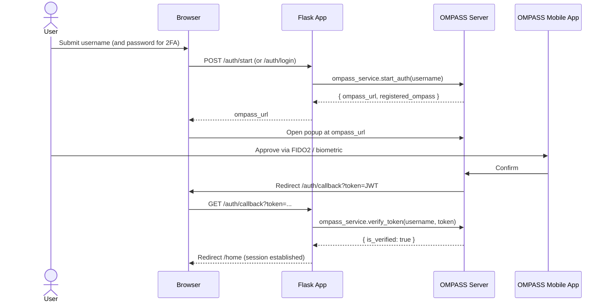
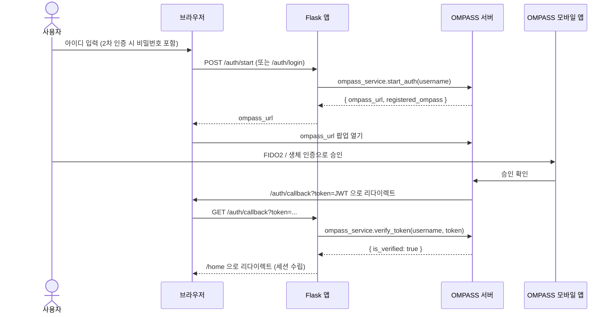

# OMPASS SDK Python Flask Example

[English](#english) | [한국어](#한국어)

---

## English

A Flask demo application showing how to integrate the **OMPASS Python SDK** for multi-factor authentication (MFA) and FIDO2 passwordless login. The app implements a minimal "DemoMail" webmail UI with full registration, login, and account-settings flows.

### Overview

The demo shows three core scenarios:

1. **Sign up** with username, email, name, and password (stored in a local SQLite DB).
2. **Login** with either:
   - Password + OMPASS 2FA (one-time biometric/FIDO2 approval on a mobile device), or
   - Passwordless OMPASS-only authentication (after the user has registered an authenticator).
3. **Settings** to register/revoke OMPASS authenticators and toggle passwordless mode.

### Authentication Flow



### Tech Stack

| Layer | Technology |
|-------|------------|
| Runtime | Python 3.10+ |
| Framework | Flask 3.x |
| Web view | Jinja2 templates |
| i18n | Flask-Babel (English / Korean / Japanese) |
| Persistence | Flask-SQLAlchemy + SQLite |
| MFA | `ompass-sdk` (OMPASS Python SDK) |
| TLS (local) | pyOpenSSL (adhoc self-signed cert) |

### Prerequisites

- Python 3.10 or later
- An **OMPASS** tenant with:
  - `client-id` and `secret-key` issued from the OMPASS admin console
  - Callback URL whitelisted: `https://localhost:8443/auth/callback`
- (For end-to-end testing) The OMPASS mobile app installed on a device

### Configuration

OMPASS credentials are read from environment variables at startup. The app **will not start** unless `OMPASS_CLIENT_ID` and `OMPASS_SECRET_KEY` are set.

| Variable | Description | Default |
|----------|-------------|---------|
| `OMPASS_CLIENT_ID` | OMPASS API client identifier | _(required)_ |
| `OMPASS_SECRET_KEY` | OMPASS API signing key (**secret**) | _(required)_ |
| `OMPASS_BASE_URL` | OMPASS backend endpoint | `https://api.ompasscloud.com` |
| `SECRET_KEY` | Flask session signing key | `demo-secret-key-change-in-production` |

> **Security note** — Never commit real secrets to source. Provide them at runtime via environment variables (or a local `.env` excluded by `.gitignore`).

The local server uses Flask's `ssl_context="adhoc"` self-signed certificate for HTTPS — **for local development only**. Use a CA-issued certificate behind a proper web server for any non-local environment.

### Quick Start

```bash
git clone git@github.com:OMSecurity/ompass-sdk-python-flask-example.git
cd ompass-sdk-python-flask-example

# Create and activate a virtual environment
python3 -m venv .venv
source .venv/bin/activate        # Windows: .venv\Scripts\activate

# Install dependencies
pip install -r requirements.txt

# Configure OMPASS credentials
export OMPASS_CLIENT_ID=your-client-id
export OMPASS_SECRET_KEY=your-secret-key
export OMPASS_BASE_URL=https://api.ompasscloud.com

# Run
python app.py
```

Open `https://localhost:8443` in a browser. Because the certificate is self-signed, your browser will show a warning — click "Advanced → Proceed" to continue.

The SQLite database is created automatically at `instance/demomail.db` on first run.

### Project Structure

```
python-flask/
├── app.py                 # Flask entry point: routes, auth flow, Babel setup
├── models.py              # SQLAlchemy User model
├── ompass_service.py      # Thin wrapper around the OMPASS SDK client
├── requirements.txt       # Python dependencies
├── babel.cfg              # Babel extraction config
├── templates/             # Jinja2 templates (login, register, home, settings, ...)
├── static/                # Static assets (CSS, JS)
├── translations/          # Compiled i18n catalogs (en / ko / ja)
└── instance/              # SQLite DB (gitignored, created at runtime)
```

### Key Endpoints

| Method | Path | Purpose |
|--------|------|---------|
| `GET`  | `/` `/login` `/register` `/home` `/settings` | Page views |
| `POST` | `/register` | Create a local account |
| `POST` | `/auth/check-user` | Check whether a user can use passwordless/2FA |
| `POST` | `/auth/login` | Password login (triggers OMPASS 2FA if registered) |
| `POST` | `/auth/start` | Start passwordless OMPASS auth |
| `POST` | `/auth/register-ompass` | Register an OMPASS authenticator |
| `POST` | `/auth/toggle-passwordless` | Enable/disable passwordless login |
| `POST` | `/auth/delete-ompass` | Revoke all OMPASS authenticators |
| `GET`  | `/auth/callback` | OMPASS redirect target; verifies the returned token |

### Internationalization

UI strings are translated via Flask-Babel. Switch languages with the `?lang=` query parameter (`en`, `ko`, `ja`). To update translations:

```bash
pybabel extract -F babel.cfg -o messages.pot .
pybabel update -i messages.pot -d translations
# edit translations/<lang>/LC_MESSAGES/messages.po
pybabel compile -d translations
```

---

## 한국어

**OMPASS Python SDK**를 사용해 다단계 인증(MFA)과 FIDO2 패스워드리스 로그인을 통합하는 방법을 보여주는 Flask 데모 애플리케이션입니다. 회원가입·로그인·계정 설정 흐름을 모두 갖춘 최소한의 "DemoMail" 웹메일 UI를 구현합니다.

### 개요

데모는 세 가지 핵심 시나리오를 보여줍니다.

1. 아이디·이메일·이름·비밀번호로 **회원가입** (로컬 SQLite DB에 저장).
2. 다음 중 하나로 **로그인**:
   - 비밀번호 + OMPASS 2차 인증 (모바일 기기에서 일회성 생체/FIDO2 승인), 또는
   - 패스워드리스 OMPASS 단독 인증 (인증장치를 등록한 경우).
3. OMPASS 인증장치 등록/해제 및 패스워드리스 모드 전환이 가능한 **설정**.

### 인증 흐름



### 기술 스택

| 계층 | 기술 |
|------|------|
| 런타임 | Python 3.10+ |
| 프레임워크 | Flask 3.x |
| 화면 | Jinja2 템플릿 |
| 다국어 | Flask-Babel (영어 / 한국어 / 일본어) |
| 저장소 | Flask-SQLAlchemy + SQLite |
| MFA | `ompass-sdk` (OMPASS Python SDK) |
| TLS (로컬) | pyOpenSSL (adhoc 자체 서명 인증서) |

### 사전 준비

- Python 3.10 이상
- 다음을 갖춘 **OMPASS** 테넌트:
  - OMPASS 관리 콘솔에서 발급한 `client-id` 및 `secret-key`
  - 콜백 URL 화이트리스트 등록: `https://localhost:8443/auth/callback`
- (엔드투엔드 테스트용) 기기에 설치된 OMPASS 모바일 앱

### 설정

OMPASS 자격증명은 시작 시 환경 변수에서 읽어옵니다. `OMPASS_CLIENT_ID`와 `OMPASS_SECRET_KEY`가 설정되지 않으면 앱이 **시작되지 않습니다**.

| 변수 | 설명 | 기본값 |
|------|------|--------|
| `OMPASS_CLIENT_ID` | OMPASS API 클라이언트 식별자 | _(필수)_ |
| `OMPASS_SECRET_KEY` | OMPASS API 서명 키 (**비밀**) | _(필수)_ |
| `OMPASS_BASE_URL` | OMPASS 백엔드 엔드포인트 | `https://api.ompasscloud.com` |
| `SECRET_KEY` | Flask 세션 서명 키 | `demo-secret-key-change-in-production` |

> **보안 주의** — 실제 시크릿을 소스에 절대 커밋하지 마세요. 런타임에 환경 변수(또는 `.gitignore`로 제외된 로컬 `.env`)로 주입하세요.

로컬 서버는 HTTPS를 위해 Flask의 `ssl_context="adhoc"` 자체 서명 인증서를 사용합니다 — **로컬 개발 전용**입니다. 비로컬 환경에서는 적절한 웹 서버 뒤에서 CA가 발급한 인증서를 사용하세요.

### 빠른 시작

```bash
git clone git@github.com:OMSecurity/ompass-sdk-python-flask-example.git
cd ompass-sdk-python-flask-example

# 가상 환경 생성 및 활성화
python3 -m venv .venv
source .venv/bin/activate        # Windows: .venv\Scripts\activate

# 의존성 설치
pip install -r requirements.txt

# OMPASS 자격증명 설정
export OMPASS_CLIENT_ID=your-client-id
export OMPASS_SECRET_KEY=your-secret-key
export OMPASS_BASE_URL=https://api.ompasscloud.com

# 실행
python app.py
```

브라우저에서 `https://localhost:8443`을 엽니다. 자체 서명 인증서이므로 브라우저가 경고를 표시합니다 — "고급 → 계속 진행"을 클릭하세요.

SQLite 데이터베이스는 최초 실행 시 `instance/demomail.db`에 자동으로 생성됩니다.

### 프로젝트 구조

```
python-flask/
├── app.py                 # Flask 진입점: 라우트, 인증 흐름, Babel 설정
├── models.py              # SQLAlchemy User 모델
├── ompass_service.py      # OMPASS SDK 클라이언트 래퍼
├── requirements.txt       # Python 의존성
├── babel.cfg              # Babel 추출 설정
├── templates/             # Jinja2 템플릿 (login, register, home, settings, ...)
├── static/                # 정적 리소스 (CSS, JS)
├── translations/          # 컴파일된 다국어 카탈로그 (en / ko / ja)
└── instance/              # SQLite DB (gitignore 처리, 런타임 생성)
```

### 주요 엔드포인트

| 메서드 | 경로 | 용도 |
|--------|------|------|
| `GET`  | `/` `/login` `/register` `/home` `/settings` | 페이지 화면 |
| `POST` | `/register` | 로컬 계정 생성 |
| `POST` | `/auth/check-user` | 패스워드리스/2차 인증 가능 여부 확인 |
| `POST` | `/auth/login` | 비밀번호 로그인 (등록 시 OMPASS 2차 인증 시작) |
| `POST` | `/auth/start` | 패스워드리스 OMPASS 인증 시작 |
| `POST` | `/auth/register-ompass` | OMPASS 인증장치 등록 |
| `POST` | `/auth/toggle-passwordless` | 패스워드리스 로그인 활성화/비활성화 |
| `POST` | `/auth/delete-ompass` | 모든 OMPASS 인증장치 해제 |
| `GET`  | `/auth/callback` | OMPASS 리다이렉트 대상; 반환된 토큰 검증 |

### 다국어 지원

UI 문자열은 Flask-Babel로 번역됩니다. `?lang=` 쿼리 파라미터(`en`, `ko`, `ja`)로 언어를 전환합니다. 번역을 갱신하려면:

```bash
pybabel extract -F babel.cfg -o messages.pot .
pybabel update -i messages.pot -d translations
# translations/<lang>/LC_MESSAGES/messages.po 편집
pybabel compile -d translations
```
